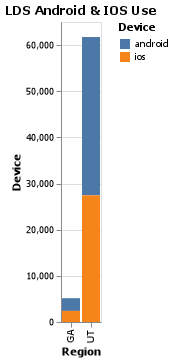
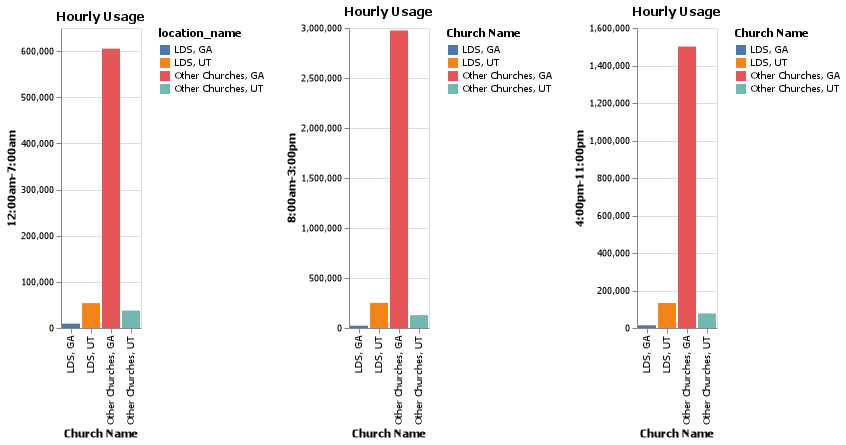
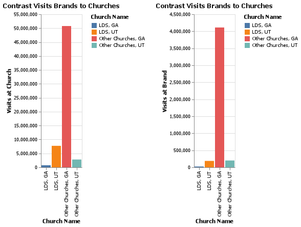

## Roberto Reynoso
### DS 460
### Challenge SafeGraph Church sp22
# Exploring Data Challenge
For this challenge, we will be comparing church buildings from Utah to the state of Georgia.

## Coding Challenge Questions


1. What differences are there between iPhone and Android users when comparing visits to The Church of Jesus Christ buildings of Latter-day Saints in Utah and Georgia?
2. Compare hourly usage patterns between The Church of Jesus Christ of Latter-day Saints and the other churches in each state.
3. Contrast the `related_same_day_brand` brands between those who visit the Church of Jesus Christ of Latter-day Saints and those who visit other churches.
4. This is a bit of a reach. Compare `related_same_day_brand` of temples, seminary buildings, and meetinghouses of The Church of Jesus Christ of Latter-day Saints.

#### What differences are there between iPhone and Android users when comparing visits to The Church of Jesus Christ buildings of Latter-day Saints in Utah and Georgia?



#### Compare hourly usage patterns between The Church of Jesus Christ of Latter-day Saints and the other churches in each state.



#### Contrast the `related_same_day_brand` brands between those who visit the Church of Jesus Christ of Latter-day Saints and those who visit other churches.


#### 4. This is a bit of a reach. Compare `related_same_day_brand` of temples, seminary buildings, and meetinghouses of The Church of Jesus Christ of Latter-day Saints.

N/A


```python
import pandas as pd
import altair as alt
import numpy as np
import os

directory = os.fsencode("data\parquet")
path = "data/parquet/"
church_data = {}
    
for file in os.listdir(directory):
     filename = os.fsdecode(file)
     if filename.endswith(".parquet"):
         # print(os.path.join(directory, filename))
         church_data.update({filename[:-8] : filename})
         continue
     else:
         continue

for k , v in church_data.items():
    print(k+"\t\t\t", v)

# data = data.join(data_device.set_index('placekey'), on='placekey')
# data =pd.merge(data, data_device[["placekey", "startDate", "endDate", "device_type", "value", "android", "ios"]], on="placekey", how="left")
# data = data.set_index('placekey').join(data_device.set_index('placekey'))

data_poi = pd.read_parquet(path + church_data["poi"])
data_device = pd.read_parquet(path + church_data["device_type"])
data_device["android"] = data_device["device_type"] == "android"
data_device["ios"] = data_device["device_type"] == "ios"
data__hour_usage = pd.read_parquet(path + church_data["open_hours"])
data_popularity_by_hour = pd.read_parquet(path + church_data["popularity_by_hour"])
data_visits_by_day = pd.read_parquet(path + church_data["visits_by_day"])
data_visitor_country_of_origin = pd.read_parquet(path + church_data["visitor_country_of_origin"])
data_visitor_home_aggregation = pd.read_parquet(path + church_data["visitor_home_aggregation"])
data_related_same_day_brand = pd.read_parquet(path + church_data["related_same_day_brand"])


# What differences are there between iPhone and Android users when comparing visits to The Church of Jesus Christ buildings of Latter-day Saints in Utah and Georgia?
data_q1 = data_poi.merge(data_device, how='left', on='placekey')
data_q1 = data_q1.drop_duplicates(subset= ["placekey", "device_type"])
data_q1 = data_q1[data_q1["location_name"].isin(["The Church of Jesus Christ of Latter day Saints",
"The Church Of Jesus Christ Of Latter Day Saints", "The Church Of Jesus Christ Of Latter Day Saints",
 "The Church of Jesus Christ of Latter Day Saints", "The Church of Jesus Christ of Latter day Saints Temple"])]
data_q1 = data_q1[data_q1["region"].isin(["UT", "GA"])]
data_q1_filtered = data_q1[["location_name", "region", "device_type", "value"]]
data_q1_ut = data_q1_filtered[data_q1_filtered["region"] == "UT"]
data_q1_ga = data_q1_filtered[data_q1_filtered["region"] == "GA"]
# print(f"UT: {data_q1_ut.sum(numeric_only=True)}\nGA: {data_q1_ga.sum(numeric_only=True)}")
data_q1_ut = data_q1_ut.groupby(["device_type", "region"]).sum().reset_index()
data_q1_ga = data_q1_ga.groupby(["device_type", "region"]).sum().reset_index()

data_q1_revised = data_q1_ut
data_q1_revised = data_q1_revised.append(data_q1_ga)

# Visual
differences = alt.Chart(data_q1_revised).mark_bar().encode(
    alt.X("region", title= "Region"),
    alt.Y("value", title="Device"),
    alt.Color("device_type", title="Device")

).properties(
    title= "LDS Android & IOS Use"
)
differences.save("screenshots/differences.png")

differences


# Compare hourly usage patterns between The Church of Jesus Christ of Latter-day Saints and the other churches in each state.
import regex as re
from datetime import datetime
from datetime import timezone
import numpy as np
import seaborn as sns
alt.data_transformers.disable_max_rows()
alt.renderers.enable('default')

data_q2 = data_poi.merge(data_popularity_by_hour, how='left', on='placekey')
data_q2 = data_q2.merge(data__hour_usage, how='left', on='placekey')
data_q2 = data_q2.drop_duplicates(subset= ["placekey", "region", "location_name", "hour", "open_hours"])

# splitting hour blocks
data_q2["12:00am-7:00am"] = data_q2["popularity_by_hour"].where(data_q2["hour"].isin([1, 2, 3, 4, 5, 6, 7, 8]))
data_q2["8:00am-3:00pm"] = data_q2["popularity_by_hour"].where(data_q2["hour"].isin([9, 10, 11, 12, 13, 14, 15, 16]))
data_q2["4:00pm-11:00pm"] = data_q2["popularity_by_hour"].where(data_q2["hour"].isin([17, 18, 19, 20, 21, 22, 23, 24]))
data_q2_days = data_q2[["region", "location_name", "12:00am-7:00am", "8:00am-3:00pm", "4:00pm-11:00pm"]]
data_q2_filtered = data_q2[["location_name", "region", "hour", "popularity_by_hour", "open_hours", "12:00am-7:00am", "8:00am-3:00pm", "4:00pm-11:00pm"]]

# sums
#data_q2_filtered.loc[(data_q2_filtered["open_hours"].isin(["Mon", "Tue", "Wed", "Thu", "Fri", "Sat", "Sun"])) & data_q2_filtered["region"] == "UT", "12:00am-7:00am-sum"] = data_q2_filtered["12:00am-7:00am"].sum()
data_q2_days = data_q2_days.groupby(["location_name", "region"]).sum().reset_index()

# mean of other churches
data_other_churches = data_q2_days[~data_q2_days["location_name"].isin(["The Church of Jesus Christ of Latter day Saints",
"The Church Of Jesus Christ Of Latter Day Saints", "The Church Of Jesus Christ Of Latter Day Saints",
 "The Church of Jesus Christ of Latter Day Saints", "The Church of Jesus Christ of Latter day Saints Temple"])]

data_other_churches = data_other_churches.groupby("region").sum()
print(data_other_churches.groupby("region").mean())
other_ga = {"location_name": "Other Churches, GA", "region": "GA", "12:00am-7:00am": 605190.0, "8:00am-3:00pm": 2974879.0, "4:00pm-11:00pm": 1501021.0}
other_ut = {"location_name": "Other Churches, UT", "region": "UT", "12:00am-7:00am": 37785.0, "8:00am-3:00pm": 129041.0, "4:00pm-11:00pm": 77744.0}

data_q2_days = data_q2_days.append(other_ga, ignore_index= True)
data_q2_days = data_q2_days.append(other_ut, ignore_index= True)

data_q2_days = data_q2_days[data_q2_days["location_name"].isin(["The Church of Jesus Christ of Latter day Saints",
"The Church Of Jesus Christ Of Latter Day Saints", "The Church Of Jesus Christ Of Latter Day Saints",
 "The Church of Jesus Christ of Latter Day Saints", "The Church of Jesus Christ of Latter day Saints Temple", "Other Churches, GA", "Other Churches, UT"])]
 
# mean of lds
data_lds = data_q2_days[data_q2_days["location_name"].isin(["The Church of Jesus Christ of Latter day Saints",
"The Church Of Jesus Christ Of Latter Day Saints", "The Church Of Jesus Christ Of Latter Day Saints",
 "The Church of Jesus Christ of Latter Day Saints", "The Church of Jesus Christ of Latter day Saints Temple"])]

data_lds = data_lds.groupby("region").sum()
data_lds.groupby("region").mean()
lds_ga = {"location_name": "LDS, GA", "region": "GA", "12:00am-7:00am": 9415.0, "8:00am-3:00pm": 22416.0, "4:00pm-11:00pm": 14410.0}
lds_ut = {"location_name": "LDS, UT", "region": "UT", "12:00am-7:00am": 53922.0, "8:00am-3:00pm": 251622.0, "4:00pm-11:00pm": 133494.0}

data_q2_days = data_q2_days[data_q2_days["location_name"].isin(["Other Churches, GA", "Other Churches, UT"])]
data_q2_days = data_q2_days.append(lds_ga, ignore_index= True)
data_q2_days = data_q2_days.append(lds_ut, ignore_index= True)


# Visual
time_1 = alt.Chart(data_q2_days).mark_bar(opacity=1).encode(
    alt.X("location_name", title="Church Name"),
    alt.Y("12:00am-7:00am"),
    color="location_name"

).properties(
    title= "Hourly Usage"
)

time_2 = alt.Chart(data_q2_days).mark_bar(opacity=1).encode(
    alt.X("location_name", title="Church Name"),
    alt.Y("8:00am-3:00pm"),
    alt.Color("location_name", title="Church Name")
).properties(
    title= "Hourly Usage"
)

time_3 = alt.Chart(data_q2_days).mark_bar(opacity=1).encode(
    alt.X("location_name", title="Church Name"),
    alt.Y("4:00pm-11:00pm"),
    alt.Color("location_name", title="Church Name")
).properties(
    title= "Hourly Usage"
)

q2 = alt.hconcat(
    time_1, time_2, time_3
).resolve_scale(
    color="independent"
)

q2.save("screenshots/q2.png")

q2


# Contrast the related_same_day_brand brands between those who visit the Church of Jesus Christ of Latter-day Saints and those who visit other churches.
data_q3 = data_poi.merge(data_related_same_day_brand, how='left', on='placekey')
data_q3 = data_q3.drop_duplicates(subset= ["placekey", "region", "location_name", "related_same_day_brand", "value"])

data_q3 = data_q3[["location_name", "region", "raw_visit_counts", "related_same_day_brand", "value"]]

# mean of other churches
data_other_churches = data_q3[~data_q3["location_name"].isin(["The Church of Jesus Christ of Latter day Saints",
"The Church Of Jesus Christ Of Latter Day Saints", "The Church Of Jesus Christ Of Latter Day Saints",
 "The Church of Jesus Christ of Latter Day Saints", "The Church of Jesus Christ of Latter day Saints Temple"])]

data_other_churches = data_other_churches.groupby(["region"]).sum().reset_index()
data_other_churches.groupby(["region"]).mean()
other_ga = {"location_name": "Other Churches, GA", "region": "GA", "raw_visit_counts": 50777561.0, "same_day_brand_value": 4111884.0}
other_ut = {"location_name": "Other Churches, UT", "region": "UT", "raw_visit_counts": 2805629.0, "same_day_brand_value": 201129.0}

data_q3 = data_q3.append(other_ga, ignore_index= True)
data_q3 = data_q3.append(other_ut, ignore_index= True)

data_q3 = data_q3[data_q3["location_name"].isin(["The Church of Jesus Christ of Latter day Saints",
"The Church Of Jesus Christ Of Latter Day Saints", "The Church Of Jesus Christ Of Latter Day Saints",
"The Church of Jesus Christ of Latter Day Saints", "The Church of Jesus Christ of Latter day Saints Temple", "Other Churches, GA", "Other Churches, UT"])]

# mean of lds churches
data_lds = data_q3[data_q3["location_name"].isin(["The Church of Jesus Christ of Latter day Saints",
"The Church Of Jesus Christ Of Latter Day Saints", "The Church Of Jesus Christ Of Latter Day Saints",
"The Church of Jesus Christ of Latter Day Saints", "The Church of Jesus Christ of Latter day Saints Temple"])]


data_lds = data_lds.groupby("region").sum().reset_index()
data_lds.groupby("region").mean()
lds_ga = {"location_name": "LDS, GA", "region": "GA", "raw_visit_counts": 739050.0, "same_day_brand_value": 23809.0}
lds_ut = {"location_name": "LDS, UT", "region": "UT", "raw_visit_counts": 7725706.0, "same_day_brand_value": 188209.0}


data_q3 = data_q3[data_q3["location_name"].isin(["Other Churches, GA", "Other Churches, UT"])]
data_q3 = data_q3.append(lds_ga, ignore_index= True)
data_q3 = data_q3.append(lds_ut, ignore_index= True)


# Visual
time_1 = alt.Chart(data_q3).mark_bar(opacity=1).encode(
    alt.X("location_name", title="Church Name"),
    alt.Y("raw_visit_counts", title="Visits at Church"),
    alt.Color("location_name", title="Church Name")  

).properties(
    title= "Contrast Visits Brands to Churches"
)

time_2 = alt.Chart(data_q3).mark_bar(opacity=1).encode(
    alt.X("location_name", title="Church Name"),
    alt.Y("same_day_brand_value", title="Visits at Brand"),
    alt.Color("location_name", title="Church Name")  
).properties(
    title= "Contrast Visits Brands to Churches"
)


q3 = alt.hconcat(
    time_1, time_2
).resolve_scale(
    color="independent"
)


q3.save("screenshots/q3.png")

q3


# This is a bit of a reach. Compare related_same_day_brand of temples, seminary buildings, and meetinghouses of The Church of Jesus Christ of Latter-day Saints.


#data_q2["hours"] = data_q2["value"].astype(str)
# data_q2["hours"] = data_q2["hours"].str.replace(":", ".", regex=True)
# data_q2["hours"] = data_q2["hours"].str.extract(r"([\D+])")
# data_q2["hours"] = 
# beep = data_q2["value"].apply(pd.Series)
# beep2 = beep[0].apply(pd.Series)
# beep2

#data_q2['hours'] = data_q2["value"].tolist()
#data_q2['hourOpen'] = np.hsplit(data_q2["hours"], 2)
#data_q2["hours"] = data_q2["hours"].astype(str)

# data_q2['hourDifference'] = data_q2['date_range_start'].sub(data_q2['date_range_end'], axis=0)


#data_q2_filitered.loc[(data_q2_filitered["12:00am-7:00am"] == True), "12:00am-7:00am-popularity"] = data_q2_filitered["popularity_by_hour"].sum()
#data_q2_filitered.loc[(data_q2_filitered["8:00am-3:00pm"] == True), "12:00am-7:00am-popularity"] = data_q2_filitered["popularity_by_hour"].sum()
#data_q2_filtered["12:00am-7:00am-popularity"] = np.where((data_q2_filtered["12:00am-7:00am"]) == True, data_q2_filtered["hour"].sum())
#data_q2_filtered["12:00am-7:00am-popularity"] = data_q2_filtered.loc[data_q2_filtered["12:00am-7:00am"] == True]
```