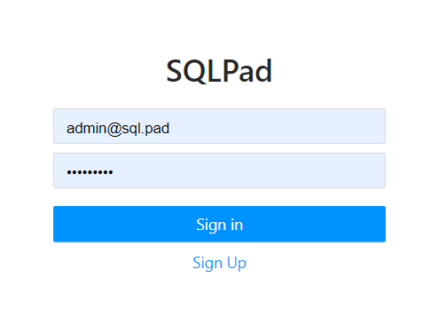
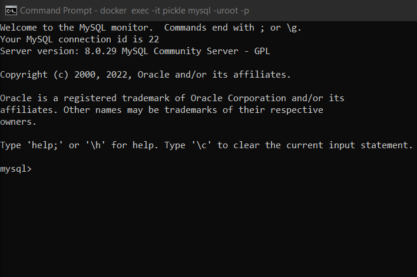
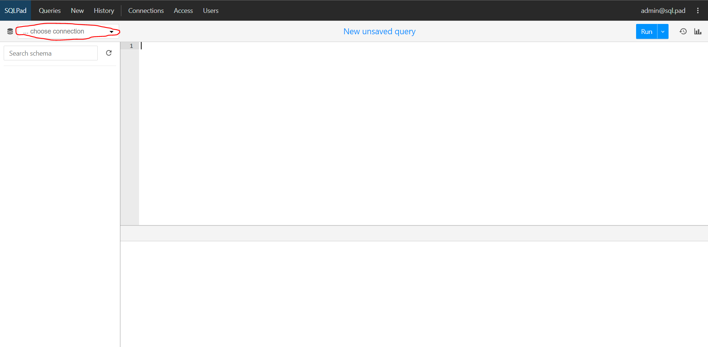
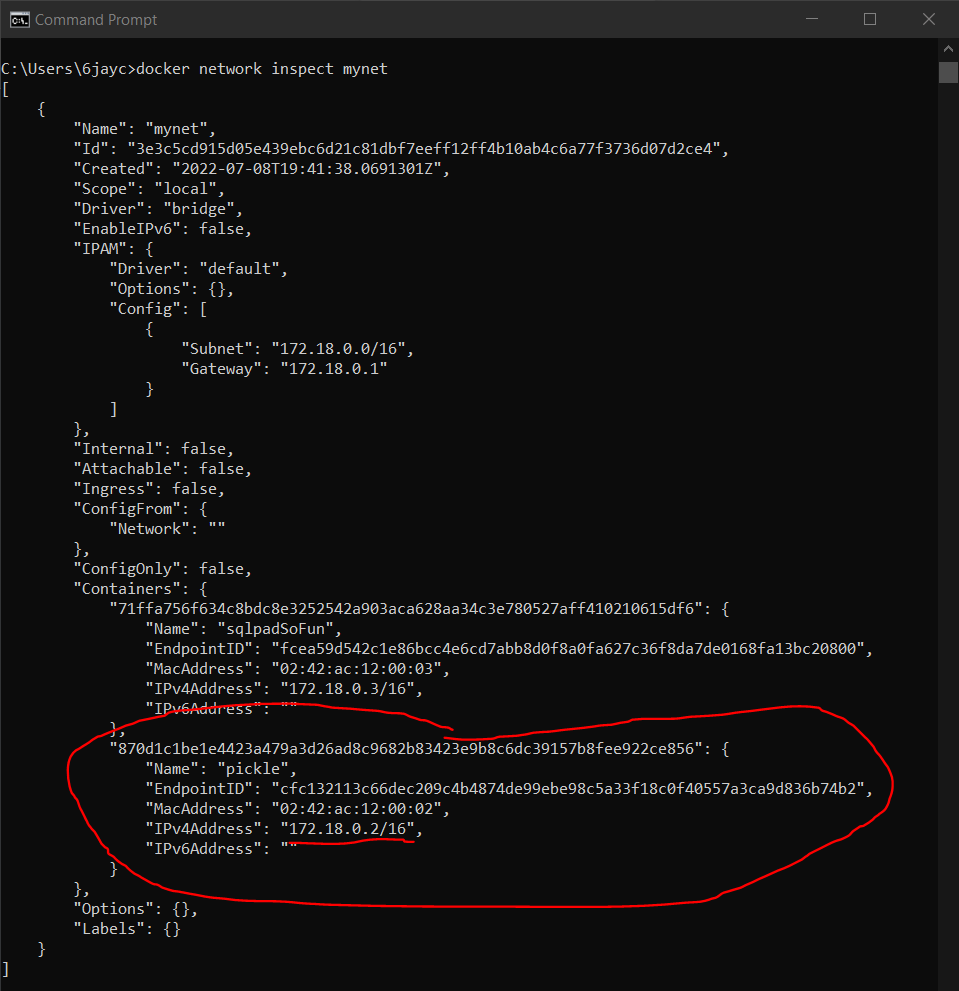
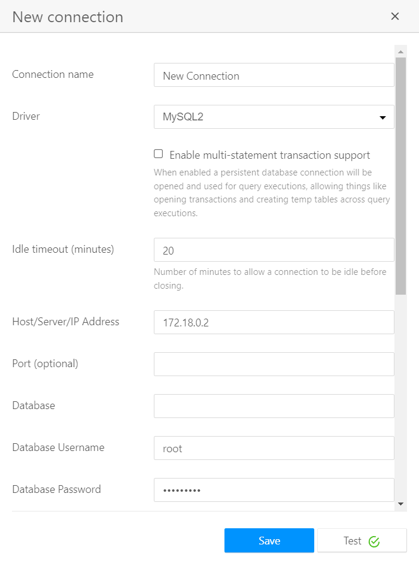
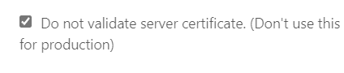

# SQLpad Tutorial
When reading this tutorial keep in mind this tutorial is for the creation and accessing of a new docker mysql container.

## Networking
In order to connect a docker cotainer to an external source, we need to make it able to connect. So in order to do that, we create a network. 
In the terminal, we can use the template below to create a network.

```
docker network create -d bridge [yourNetworkName]
```

Where [yourNetworkName] is the name of the network you wish to create.

This creates a docker accessable nework to connect your containers to other sources.

below is the code we will use for the example.

```
docker network create -d bridge mynet
```

In this example, you will see, the name we gave to our network was "mynet".

We can check our docker networks using ```docker network ls``` you should see something similar to this with your network in it.

```
NETWORK ID     NAME      DRIVER    SCOPE
5bc4dc5b030c   bridge    bridge    local
277c3dae453e   host      host      local
3e3c5cd915d0   mynet     bridge    local
c1bbaccb81c9   none      null      local
```


## Setting up SQLpad
Now that we have a network, we will need to have something to connect. 

### Creating the container
The first thing we will make is a sqlpad container using the template below in the terminal.

```
docker run -p [desiredPort] -e SQLPAD_ADMIN=[yourAdminEmail] -e SQLPAD_ADMIN_PASSWORD=[yourAdminPass] -d --name=[sqlpadContainerName] --network=[yourNetworkName] sqlpad/sqlpad:[desiredSQLpadversion]
```
Below will explain what each segment of this code does

- docker run - Tells the terminal that this is a docker command and that it should be run
- -p [desiredPort] - Tells docker what network port the container should be made on
- -e SQLPAD_ADMIN=[yourAdminEmail] - Sets up an admin email for sqlpad 
- -e SQLPAD_ADMIN_PASSWORD=[yourAdminPass] - Sets the password for the admin email
- -d --name=[sqlpadContainerName]  - Sets the name of your sqlpad container
- --network=[yourNetworkName] - Tells docker to connect the container to your network
- sqlpad/sqlpad:[desiredSQLpadversion] - tells docker that sqlpad is the type of container you want and which version

Below is the code we will be using for this example.

```
docker run -p 3000:3000 -e SQLPAD_ADMIN=admin@sql.pad -e SQLPAD_ADMIN_PASSWORD=adminpass -d --name=sqlpadSoFun --network=mynet sqlpad/sqlpad:master
```

now if we use ```docker ps``` in our terminal, it will pull up our containers and you should see something similar to this

```
CONTAINER ID   IMAGE                  COMMAND                CREATED         STATUS         PORTS                    NAMES
14587e65b327   sqlpad/sqlpad:master   "/docker-entrypoint"   4 minutes ago   Up 4 minutes   0.0.0.0:3000->3000/tcp   sqlpadSoFun
```

### Using the container
now that we have sqlpad running we can log in through our browser. 
The url will be ```http://localhost[yourMainPort]``` it can be typed in like shown below


Once you have done that, you should see a simple login screen like the one below. Log in with the email and password you set before, and you will have access to sqlpad.



## Setting up MySQL
Although we have a UI, we don't have anything for the UI to affect. So we will make a mysql container for it to connect to.

### Creating a MySQL Container
Now that wr have SQLpad ready, we need a mysql container to connect to. Below is a template for the code to create a mysql container.

```
docker run --name=[mysqlContainerName] --publish [desiredPort] --env MYSQL_ROOT_PASSWORD=[yourMysqlRootPass] --detach --network=[yourNetworkName] -e MYSQL_HOST_AUTH_METHOD=trust mysql/mysql-server:[desiredMysqlVersion]
```

Below explains what each portion of this code does

- docker run - Tells the terminal to run a docker command
- --name=[mysqlContainerName] - Sets the name of a new container
- --publish [desiredPort] - Sets the port you want your container to work through
- --env MYSQL_ROOT_PASSWORD=[yourMysqlRootPass] - Sets a root password for your mysql container
- --detach - tells docker to run this in the background of your terminal
- --network=[yourNetworkName] - Tells the container to use a network
- -e MYSQL_HOST_AUTH_METHOD=trust - Makes mysql trust your inputs that could endanger data
- mysql/mysql-server:[desiredMysqlVersion] - Specifies what type of container your making and which version

Below is the code we will use for this example

```
docker run --name=pickle --publish 331:331 --env MYSQL_ROOT_PASSWORD=mysqlpass --detach --network=mynet -e MYSQL_HOST_AUTH_METHOD=trust mysql/mysql-server:latest
```

now if you run ```docker ps``` you should have your sqlpad container and your mysql container

### Getting MySQL Ready
Although we have a mysql container, it still won't want to connect, thats because the container comes with some barriers to protect data.

First, we'll have to start up our mysql container so that we can talk to it. We can do that using the template below where [yourMysqlContainerName] is the name of your container and [yourMysqlRootPass] is the password you set before.

```
docker exec -it [yourMysqlContainerName] mysql -uroot -p[yourMysqlRootPass]
```

Below is the code for our example

```
docker exec -it pickle mysql -uroot -pmysqlpass
```

This should pull up a mysql terminal like shown below.



Now in the mysql terminal, we can put in some code to open up the connection capabilities

First, we want to tell it that we are wanting to connect to the root, we can do that with the code below

```
update mysql.user set host = '%' where user='root';
```

Now, we want to change our user to be the root host, to do that we will use the template below.

```
ALTER USER 'root'@'%' IDENTIFIED WITH mysql_native_password BY '[yourMysqlRootPass]';
```

Below is the code we are using for the example.

```
ALTER USER 'root'@'%' IDENTIFIED WITH mysql_native_password BY 'mysqlpass';
```

you may run into an error if thats the case, run the code below then try again

```
GRANT ALL ON *.* TO 'root'@'%';
```

Now we have our mysql container ready to connect to sqlpad.

## Connecting
Now that we have our containers set up, we just need to connect them.

First, in your browser, click new connection in the upper left of your browser. then click new connection from the dropdown menu



Now you input the information on your connection you want to make. Input the connection name you want to use for sqlpad, then select mysql2 as your driver.

Once you've do that more input fields will show up. Input your mysql ip address in the Host/Server/IPaddress field. You can find this in your detailed network information.

to see your detailed network information for docker use the template below.

```
docker network inspect [yourNetworkName]
```

For this example we can use the code

```
docker network inspect mynet
```

Now that we've done that, we can use the IPv4 address for our mysql container as shown below.



Once you've put that in, put "root" as the username and your mysql password as the password.



Then scroll donw and check the box labeled "Do not validate server certificate. (Don't use this for production)"



Hit test and you should get a green checkmark. Hit save, and your done. 

You can now run sql code on your browser just like you would with mysql.
